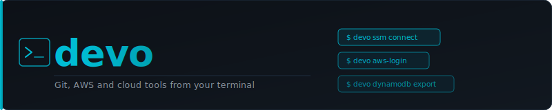

<div align="center">



[](https://github.com/edu526/devo-cli/releases/latest) [](https://github.com/edu526/devo-cli/releases) [](https://opensource.org/licenses/MIT) [](https://www.python.org/downloads/) [](https://github.com/edu526/devo-cli/releases) [](https://sonarcloud.io/summary/new_code?id=edu526_devo-cli) [](https://sonarcloud.io/summary/new_code?id=edu526_devo-cli)

</div>

---

## Install

**Linux / macOS**
```bash
curl -fsSL https://devo.heyedu.dev/install.sh | bash
```

**Windows (PowerShell)**
```powershell
irm https://devo.heyedu.dev/install.ps1 | iex
```

## What it does

| Command | Description |
|---------|-------------|
| `devo ssm connect` | Secure port-forwarding tunnel to private databases via AWS SSM |
| `devo aws-login` | AWS SSO authentication — refreshes all profiles at once |
| `devo dynamodb export` | Export any DynamoDB table to CSV or JSON |
| `devo commit` | AI-generated commit messages via AWS Bedrock |
| `devo code-reviewer` | AI code review with security analysis before opening a PR |
| `devo codeartifact-login` | Authenticate npm/pip against AWS CodeArtifact |
| `devo upgrade` | Self-update to the latest release |

## Devo Desktop

In addition to the CLI, there is a **Tauri 2.x desktop app** that bundles
the same workflows with a Svelte UI, a system tray icon, and live
tunnel metrics. The desktop app embeds the CLI as a Python sidecar
(FastAPI + WebSocket) so all backend code is shared 1:1 with the
terminal.

| Platform | Bundle | Notes |
|---|---|---|
| Linux | `.AppImage` | x86_64, WebKitGTK 4.1 + glibc 2.31+ |
| macOS | `.dmg` (aarch64 + x86_64) | Apple Silicon + Intel |
| Windows | `.msi` + NSIS `.exe` | x86_64, WebView2 runtime required |

See the user guide for install + auto-update details:
[`docs/guides/desktop-installation.md`](docs/guides/desktop-installation.md)
and [`docs/guides/desktop-auto-update.md`](docs/guides/desktop-auto-update.md).

## Quick start

```bash
# Connect to a private database through SSM
devo ssm connect mydb

# Refresh all AWS SSO profiles
devo aws-login

# Export a DynamoDB table
devo dynamodb export my-table

# Generate a commit message
devo commit
```

## Documentation

Full docs at **[devo.heyedu.dev](https://devo.heyedu.dev)**

## License

MIT — see [LICENSE](LICENSE) for details.
